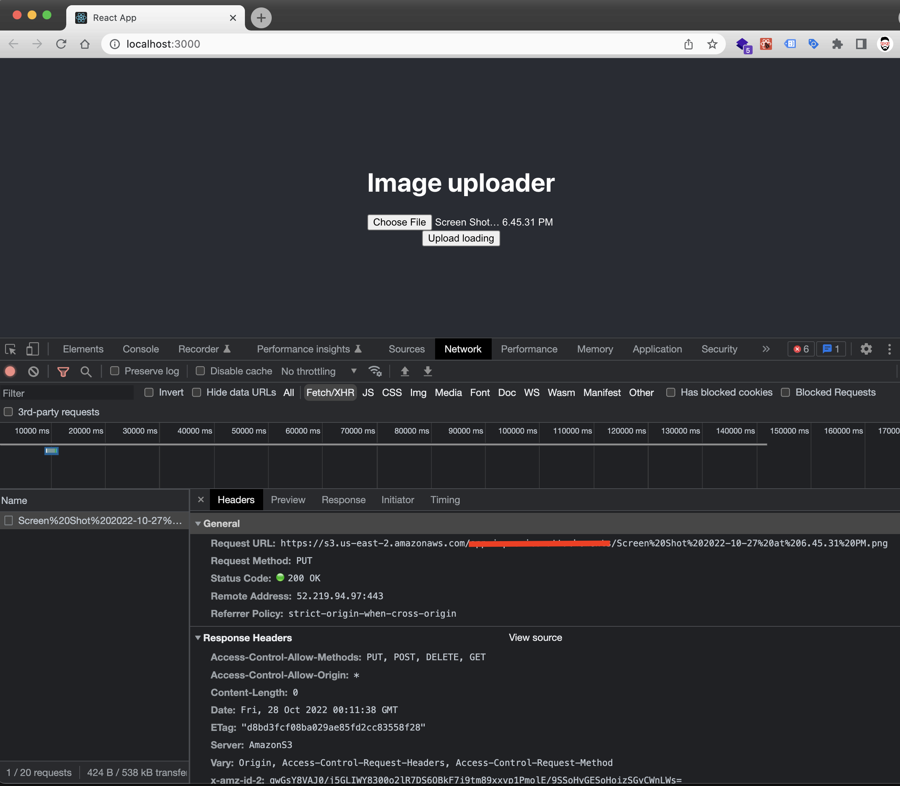

# How to upload images or files to AWS S3 from a React App

1. Clone project
2. Install dependencies with `$ npm install`
3. Create `.env` file where to put the AWS Access key and Secret Access key like this: 
```bash
# .env file
REACT_APP_S3_BUCKET=your-bucket-name
REACT_APP_AWS_KEY=your-aws-key
REACT_APP_AWS_SECRET_KEY=your-aws-secret-access-key 
```
4. Run project with `npm start`
5. Try to select a file and upload
6. Then check your S3 bucket

